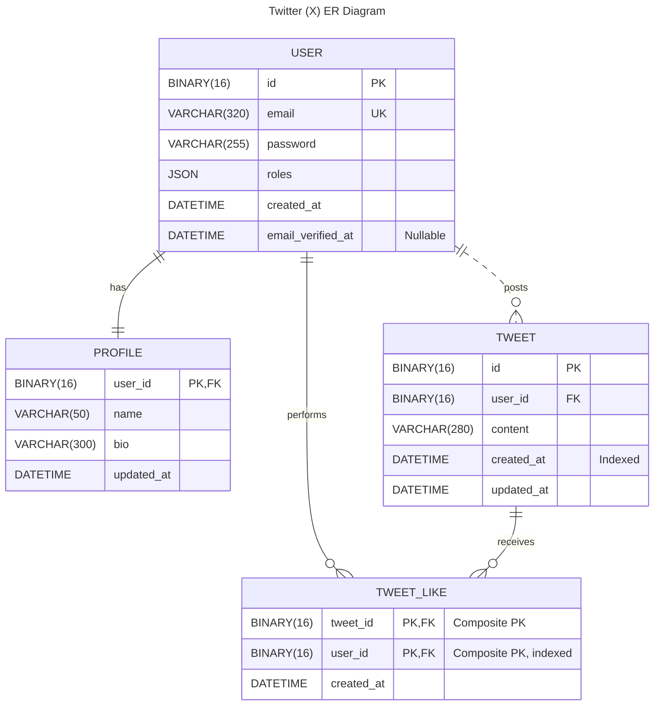

# Twitter (X) Clone &mdash; Database Design

This document describes the database structures of the Twitter (X) clone
developed within EPAM PHP Laboratory.

## Technical Standards and Conventions

| Category          | Decision     | Rationale                                 |
|:------------------|:-------------|:------------------------------------------|
| **DBMS**          | `MySQL`      | Speed, reliability and popularity.        |
| **Charset**       | `utf8mb4`    | Full Unicode support (emojis, etc.).      |
| **Identity (PK)** | `UUID v7`    | Safety, global uniqueness, time-sortable. |
| **ID Storage**    | `BINARY(16)` | Speed and space saving.                   |

## Entity-Relationship Diagram

## Data Dictionary and Entities

### Table: `user`

Stores only data required for authentication and authorization.

| Field               | Type           | Attributes       | Description                       |
|:--------------------|:---------------|:-----------------|:----------------------------------|
| `id`                | `BINARY(16)`   | **PK**           | Unique identifier (UUID v7).      |
| `email`             | `VARCHAR(320)` | **UK**, Not Null | User login.                       |
| `password`          | `VARCHAR(255)` | Not Null         | Password hash.                    |
| `roles`             | `JSON`         | Not Null         | Array of roles.                   |
| `created_at`        | `DATETIME`     | Not Null         | Registration date and time.       |
| `email_verified_at` | `DATETIME`     | Nullable         | Email verification date and time. |

* Email must be unique across the system.
* Users are assigned the `ROLE_USER` role by default upon creation.

### Table: `profile`

Public user information. Separated from `user`.

| Field        | Type           | Attributes | Description                        |
|:-------------|:---------------|:-----------|:-----------------------------------|
| `user_id`    | `BINARY(16)`   | **PK, FK** | Foreign key to `user.id`.          |
| `name`       | `VARCHAR(50)`  | Not Null   | Displayed name.                    |
| `bio`        | `VARCHAR(300)` | Nullable   | User biography.                    |
| `updated_at` | `DATETIME`     | Nullable   | Last profile update date and time. |

### Table: `tweet`

The main content unit.

| Field        | Type           | Attributes | Description                          |
|:-------------|:---------------|:-----------|:-------------------------------------|
| `id`         | `BINARY(16)`   | **PK**     | Tweet identifier.                    |
| `user_id`    | `BINARY(16)`   | **FK**     | Reference to the author (`user.id`). |
| `content`    | `VARCHAR(280)` | Not Null   | Tweet text body.                     |
| `created_at` | `DATETIME`     | **Index**  | Publication date and time.           |
| `updated_at` | `DATETIME`     | Nullable   | Edit date and time.                  |

### Table: `tweet_like`

Junction table (Many-to-Many) for likes.

| Field        | Type         | Attributes | Description                    |
|:-------------|:-------------|:-----------|:-------------------------------|
| `tweet_id`   | `BINARY(16)` | **PK, FK** | Part of composite primary key. |
| `user_id`    | `BINARY(16)` | **PK, FK** | Part of composite primary key. |
| `created_at` | `DATETIME`   | Not Null   | Event date and time.           |

The table has composite primary key: `(tweet_id, user_id)`. This prevents a
user from liking the same tweet twice.

## Indexes

| Table        | Index / Key             | Use Case                                     |
|:-------------|:------------------------|:---------------------------------------------|
| `user`       | `UNIQUE(email)`         | Fast user lookup during login.               |
| `tweet`      | `IDX(created_at DESC)`  | Chronological Feed generation.               |
| `tweet`      | `IDX(user_id)`          | Fetching all tweets by a specific user.      |
| `tweet_like` | `PK(tweet_id, user_id)` | Checking whether a user liked a tweet.       |
| `tweet_like` | `IDX(user_id)`          | Fetching a list of tweets liked by the user. |

## Normalization

The database schema adheres to **Boyce-Codd Normal Form (BCNF)**.
